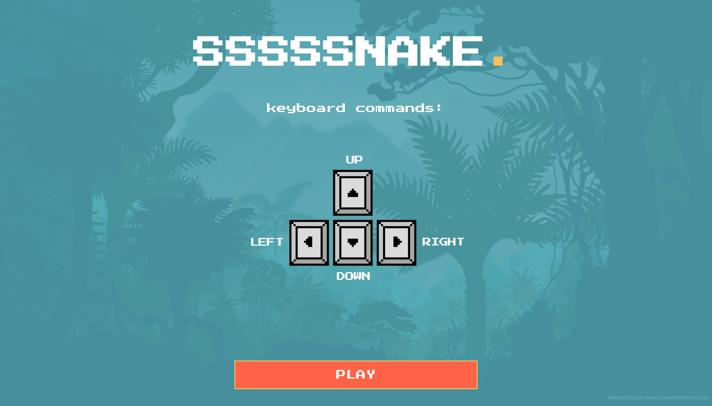
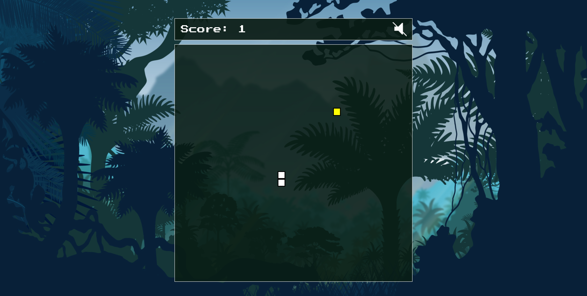
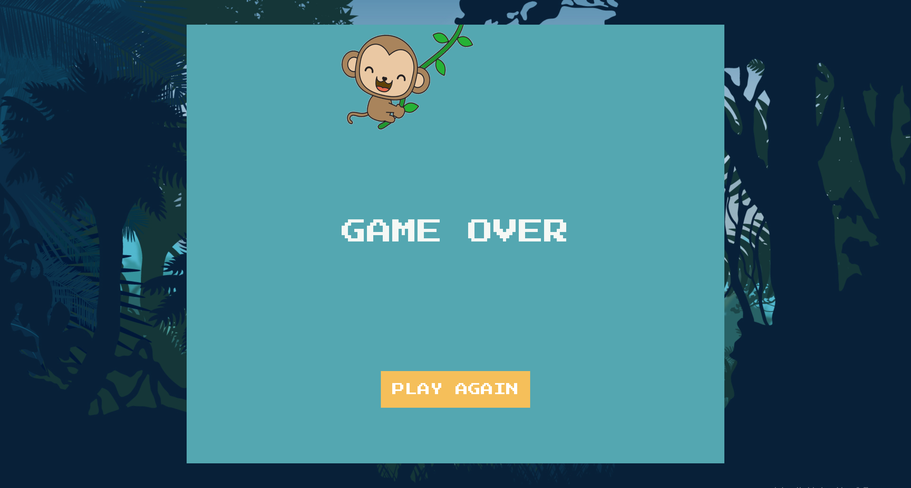

<!-- ## Start the app

In the project directory, you can run:

### `npm install` -->

## Overview

This is a clone of mobile snake game, built with Vanilla JavaScript

## Features

- Snake moves in a different direction controlled by keyboard keys
- 'Food' pieces display randomly, never within snake's body
- Addition to snake's length when 'food' was 'eaten'
- Snake speeds up after every fifth piece 'eaten'
- Points are collected depending on number of eaten pieces
- Gameover when snake's head hits the edge of the container or its own body
- Stop jungle sounds by clicking on the sound icon
- Sound plays when 'food' picked
- Restart the game

## Technologies

- HTML
- CSS
- JavaScript

## Preview

Play the game

[a link](https://ararita.github.io/snake-game/?fbclid=IwAR1wRA2zQSglaToSW6-jc7fEuK5TjE79F0yNgd1htXMHstgVEX7joMJyIWM)

Start the game

Play

Game Over

## Roadmap

Solve known bugs
